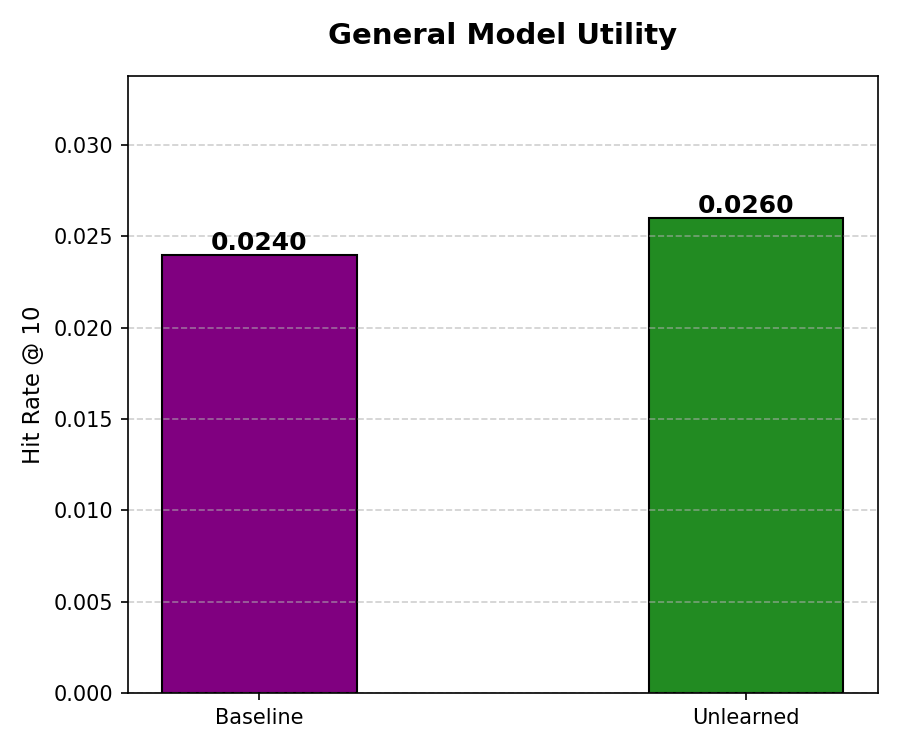
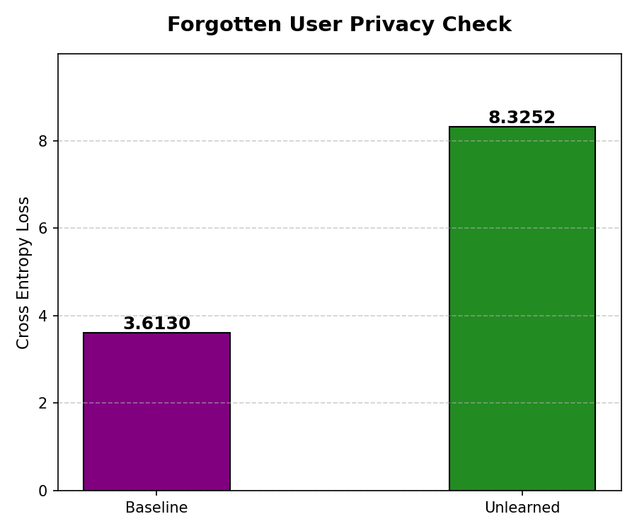

# Decoupled Architecture for Privacy-Compliant Recommendation

## Overview
This repository implements a decoupled recommender system to address the "Right to be Forgotten" in production environments. Standard deep learning models (like monolithic Transformers) mix user and item data, which makes deleting a single user impossible without retraining the entire model.

This project uses a **Decoupled Architecture** that physically separates item learning from user history processing. This separation allows for the effective removal of user data by discarding local parameters while keeping the global item model intact.

## System Architecture
The solution combines **Neural Collaborative Filtering (NCF)** and **Self-Attentive Sequential Recommendation (SASRec)**:

1.  **Item Tower (Cloud / Public):** A Two-Tower network trains on global interactions to learn item-to-item compatibility. These embeddings are extracted and **frozen**, preventing user-specific gradients from leaking into the central model.
2.  **User Tower (Edge / Private):** A local Adapter Layer (Linear-ReLU-Linear) projects the frozen item embeddings into a latent space for a SASRec Transformer, which learns sequential history locally.

## Data & Methodology
* **Dataset:** KuaiRec 2.0 (Filtered for positive interactions with `watch_ratio` ≥ 1.0).
* **Debiasing:** Applied Inverse Propensity Weighting (IPW) during training to fix popularity bias and ensure niche content representation.
* **Validation Method:** **Exact Retraining**. To verify the unlearning, we trained two distinct models from scratch: a "Baseline" (containing all users) and an "Unlearned Model" (excluding the target user). This provides a mathematical ground truth for evaluation.

## Evaluation Results

### 1. General Utility (Hit Rate @ 10)
Impact on the general user base was measured using Hit Rate @ 10 on a held-out test set.

*Figure 1: Comparison of recommendation quality. The unlearned model demonstrates stable utility (0.0260) compared to the baseline (0.0240), confirming that unlearning a user does not degrade system performance for the remaining population.*

### 2. Privacy Verification (Cross Entropy Loss)
Erasure was verified by calculating Cross Entropy Loss on the target user's historical training sequences. A spike in loss indicates the model has lost its predictive capability for that specific user.

*Figure 2: Privacy verification. The sharp increase in loss (3.61 → 8.32) for the unlearned model confirms the effective removal of the user's data patterns, approaching random guessing levels.*

## Repository Structure

* `01_Data_Prep_Debiasing.ipynb`: Data preprocessing, sequence generation, and calculation of Inverse Propensity Weights (IPW).
* `02_Cloud_Item_Tower.ipynb`: Training of the Two-Tower candidate generation model and extraction of the frozen item embedding matrix.
* `03_Edge_SASRec_Training.ipynb`: Implementation of the Adapter Layer and SASRec Transformer. Execution of the "Exact Retraining" simulation (Baseline vs. Unlearned models).
* `04_Evaluation.ipynb`: Calculation of Utility (HR@10) and Privacy (Cross Entropy) metrics, and generation of visualization charts.

## References
1.  **KuaiRec Dataset:** Gao, C., et al. (2022). "KuaiRec: A Fully-Observed Dataset...". CIKM.
2.  **IPW:** Schnabel, T., et al. (2016). "Recommendations as Treatments: Debiasing Learning and Evaluation". ICML.
3.  **SASRec:** Kang, W. C., & McAuley, J. (2018). "Self-Attentive Sequential Recommendation". ICDM.
